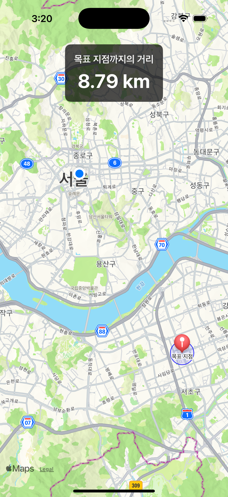

##T-Fence: 근접 경보 LBS 포트폴리오

###1. 프로젝트 개요 (Overview)

T-Fence는 특정 목표 지점(Geofence)에 사용자가 접근했을 때, 백그라운드에서도 알림을 보내주는 위치 기반 근접 경보(Proximity Alert) iOS 앱입니다.

이 프로젝트는 티맵 모빌리티의 iOS 개발자 모집 공고에 명시된 GPS, 좌표계, Objective-C 경험, LBS 지식 등의 핵심 역량을 압축적으로 보여주기 위해 기획되었습니다. 단순한 기능 구현을 넘어, Swift와 Objective-C를 함께 사용하는 하이브리드 환경에서의 개발 능력과 위치 기반 서비스의 핵심 원리에 대한 깊은 이해도를 증명하는 것을 목표로 합니다.

###2. 실행 화면 

###3. 핵심 기능 및 구현 기술

📍 실시간 위치 추적 및 거리 계산

CoreLocation 프레임워크를 사용하여 사용자의 현재 위치를 실시간으로 추적합니다.

Objective-C로 작성된 DistanceCalculator 클래스를 Swift-Objective-C Bridging을 통해 호출하여, 현재 위치와 목표 지점(강남역) 사이의 거리를 실시간으로 계산하고 화면에 표시합니다.

📡 지오펜싱(Geofencing) 및 백그라운드 알림

목표 지점 주변에 반경 500m의 가상 울타리(CLCircularRegion)를 설정합니다.

앱이 백그라운드 상태일 때도, 사용자가 이 영역에 진입하는 이벤트를 감지(didEnterRegion)합니다.

UserNotifications 프레임워크를 사용하여 사용자에게 "목표 지점에 접근했습니다!" 라는 로컬 알림을 전송합니다.

🗺 지도 시각화

**MapKit**을 사용하여 지도를 표시하고, 사용자의 현재 위치와 목표 지점을 시각적으로 보여줍니다.

UIViewRepresentable을 통해 UIKit 기반의 MKMapView를 SwiftUI 환경에 통합하여 사용했습니다.

목표 지점의 경보 영역을 MKCircle 오버레이로 시각화하여 사용자가 직관적으로 인식할 수 있도록 구현했습니다.

###4. 기술 심층 분석 (Technical Deep Dive)

왜 Objective-C를 사용했는가? (Bridging)

티맵과 같이 오랜 역사를 가진 서비스는 중요한 핵심 로직이나 저수준 그래픽 처리(OpenGL) 등이 Objective-C로 작성되어 있을 가능성이 높습니다. 이 프로젝트에서 거리 계산이라는 핵심 모듈을 의도적으로 Objective-C로 작성하고, Swift-Objective-C Bridging Header를 통해 이를 Swift 코드에서 완벽하게 통합하는 과정을 구현했습니다.

이는 단순히 Objective-C 문법을 아는 것을 넘어, 레거시 코드와 최신 Swift 코드를 함께 관리하고 운영할 수 있는 실무적인 능력을 보여주기 위함입니다.

거리 계산은 어떤 원리로 동작하는가?

거리 계산의 핵심은 DistanceCalculator.m 파일에 구현되어 있습니다.
